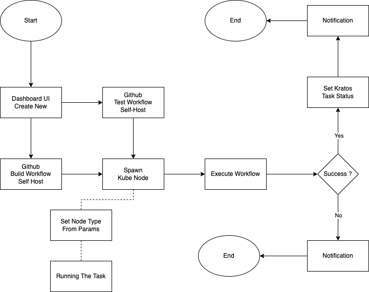

### Ide dan Konsep
Membangun workflows self hosted untuk dapat berjalan di atas cluster kubernetes, memanfaatkan kelebihan scalability kubernetes yang akan membantu jika terjadi lonjakan beban pekerjaan. Guna mengintegrasikan workflows dengan internal dashboard dan database untuk melakukan perekaman versioning sistem dan pengumpulan metrics yang terjadi di dalam proses CI / CD.

### Tujuan
- Memecahkan masalah kinerja berlebihan yang terjadi dengan menggunakan Virtual Machine karena proses scalling yang memakan waktu
- Melakukan multiple build berdasarkan ref/branch yang digunakan, untuk melakukan testing pre-production
- Perbaikan sistem dan modernisasi, guna mempermudah operasional dalam mengelola infrastruktur dengan kubernetes
- Permasalahan security dengan menggunakan built-in github host, sistem yang berjalan di dalamnya tidak dapat dikontrol oleh organisasi

### Limitasi
- Proses yang terjadi di dalam workflows tidak serta merta dapat di mapping ke versi yang telah di tentukan sebelumnya di dalam sistem internal
- Proses untuk menemukan verifikasi proses terjadi dari sisi github ke internal sistem. Sehingga jika terjadi kendala disaat melakukan pemanggilan API, dapat dipastikan proses tidak dapat dinyatakan sukses atau gagal. Harus dilakukan pengecekan manual dan mencari workflow yang berkaitan dengan versi yang stuck untuk melihat kondisi yang terjadi.

### Flow Diagram

